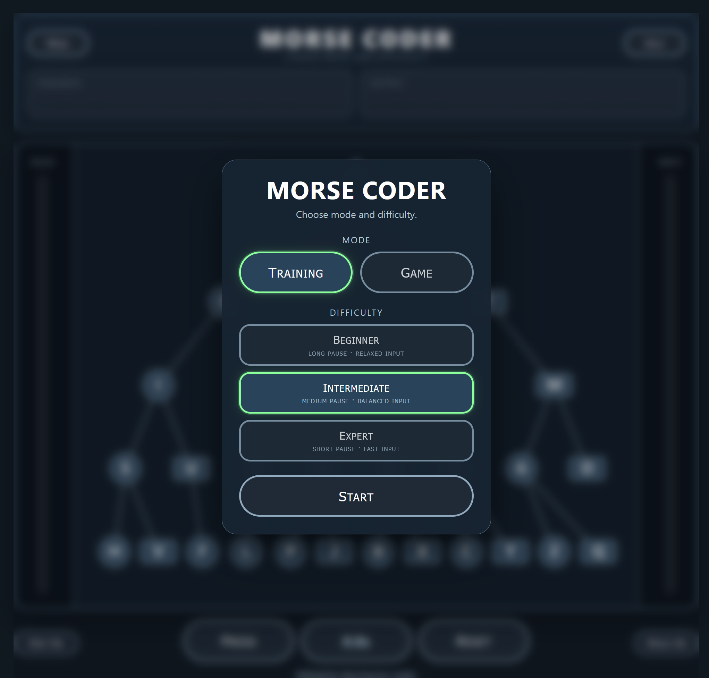
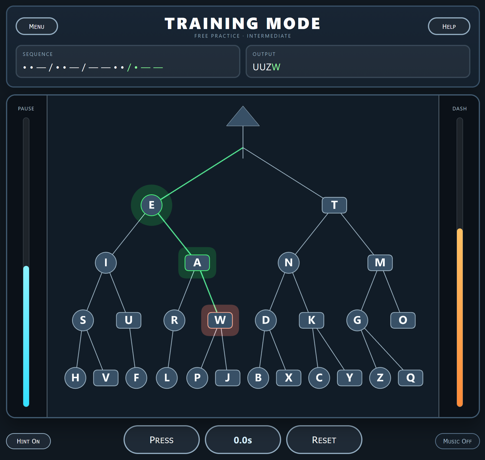

# Morse Coder

Morse Coder is a browser-based Morse code trainer and game.  
It visualizes the Morse tree with Three.js, gives live input feedback, supports difficulty modes, audio cues, optional hints, and a target-word game mode.

## Live Version

[Check the live version right here!](https://tz-dev.github.io/morse-coder/)

## Features

- Training mode for free Morse practice
- Game mode with rotating target words
- Beginner, Intermediate, and Expert difficulty presets
- Visual Morse tree with live path highlighting
- Optional next-letter hint
- Pause meter for letter separation and game-over countdown
- Progress meter in game mode
- Keyboard and mouse input support
- Background noise toggle and sound effects
- Game-over dialog with quick replay

## Screenshots





## Controls

### Main input

| Action | Mouse | Keyboard |
|---|---|---|
| Dot / short | Left click | Space |
| Dash / long | Right click | Enter |

### Extra shortcuts

- Dot / short: `.`, `,`, Arrow Left
- Dash / long: `-`, `_`, Arrow Right
- Backspace: delete current input
- Escape: open / close menu or overlay
- 1 / 2 / 3: switch difficulty
- Game Over: Arrow Left / Arrow Right to choose, Enter to confirm

## File Structure

```text
morse-coder/
├─ index.html
├─ css/
│  └─ styles.css
├─ img/
│  ├─ screenshot00.png
│  └─ screenshot01.png
├─ js/
│  └─ app.js
└─ snd/
   ├─ morse_short.wav
   ├─ morse_long.wav
   ├─ wrong.wav
   ├─ click.mp3
   ├─ win.wav
   ├─ lose.wav
   └─ noise.wav
````

## Setup

Download the repository and open `index.html` in a browser.

For local development, using a small local server is recommended:

```bash
python3 -m http.server
```

Then open the shown local URL in your browser.

## Configuration

Most gameplay, audio, and visual settings are adjustable at the top of `js/app.js`.

Important sections:

```js
DIFFICULTIES
TARGET_WORDS
SOUND_PATHS
TREE_WIDTH
TREE_ROOT_Y
TREE_STEP_Y
NODE_LABEL_SIZE
```

Each difficulty can define:

```js
interLetterGapMs
autoFinishDelayMs
gameOverPauseUnits
shortInputCooldownMs
longInputCooldownMs
wordPool
```

## License

MIT
